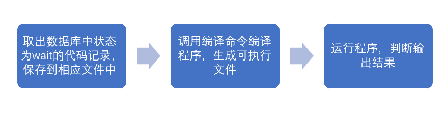
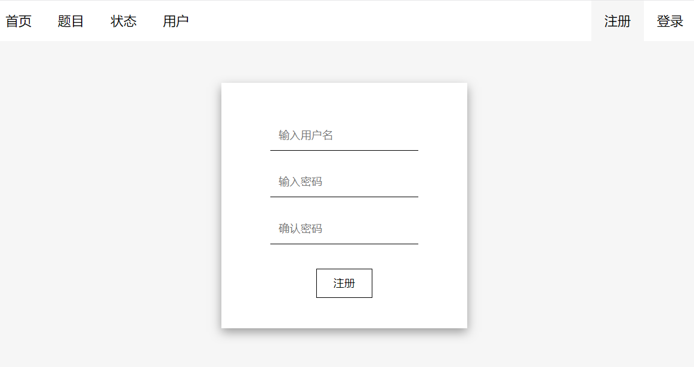
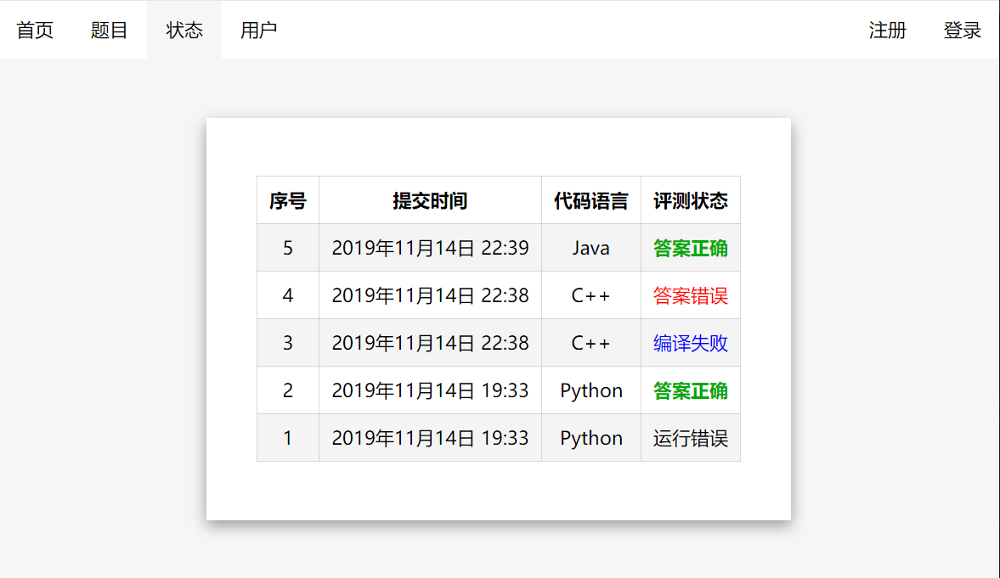

## Python期末个人项目

### 1. 实验目的
考察利用Python进行项目开发的能力。

### 2. 实验要求
任选一个项目进行完成；
编写项目开发报告。

### 3. 实验内容

#### 项目说明
本项目目标是实现一个简易的在线评测系统，支持用户注册、登录、查看用户信息、查看题目、提交代码、评测代码、查询评测结果等功能。使用Python搭建服务器后台，并编写简单的前端页面进行测试。

#### 设计说明
##### 整体架构设计
本项目采用函数组织程序架构，所有函数说明见下表：

|    函数名     |             函数功能              |
| ------------ | --------------------------------- |
| md5          | 计算字符串md5值，用于密码存储       |
| init_db      | 初始化数据库，创建user表和status表 |
| post_user    | 实现注册功能，创建新用户，写入数据库 |
| login        | 实现登录功能，检验用户密码是否正确   |
| get_user     | 获取用户信息                       |
| get_status   | 获取评测状态                       |
| post_status  | 实现提交代码功能，保存代码，等待评测 |
| judge        | 评测程序                          |
| compile      | 编译程序，生成可执行文件            |
| update_state | 更新评测状态                       |
| judge_run    | 运行程序，判断结果是否正确          |
| main         | 主函数，启动服务                   |

##### 数据存储模块设计
根据项目说明，本项目目的在于实现简易的评测系统，且数据量不大，因此存储数据选用了相对较简单的sqlite。SQLite3可使用sqlite3模块与Python进行集成，而且不需要单独安装该模块，Python默认自带了该模块，使用起来非常方便。

user表结构：
     
|       列名        |  类型  |    说明     |
| ----------------- | ----- | ----------- |
| id                | 整数   | 用户序号     |
| username          | 字符串 | 用户名      |
| password          | 字符串 | 密码        |
| register_time     | 整数   | 注册时间     |
| last_login_time | 整数   | 上次登录时间 |
| last_login_ip   | 字符串 | 上次登录IP   |

password存储使用md5加密后的用户密码。

stauts表结构：
  
|  列名   |  类型  |      说明       |
| ------- | ----- | --------------- |
| id      | 整数   | 评测记录序号     |
| user    | 整数   | 提交评测用户序号 |
| problem | 整数   | 评测对应题目序号 |
| time    | 整数   | 评测提交时间     |
| lang    | 字符串 | 程序语言        |
| code    | 字符串 | 源代码          |
| status  | 字符串 | 评测结果        |

其中id为从1开始自增，时间均用Unicode时间戳精确到秒。

评测结果status的可能值如下：

|  status可能值  |            描述            |
| ------------- | ------------------------- |
| accept        | 成功运行，答案正确，通过评测 |
| wrong_answer  | 程序成功运行，但答案错误     |
| runtime_error | 程序运行时错误              |
| wait          | 程序已保存，正在等待评测     |

##### web后台框架设计
Python作为脚本语言，有着简洁，快速，框架多的特点，本项目选用了较为出名的flask框架开发，结合flask_cors模块实现跨域，完美实现前后端分离，使得Python专注于后台逻辑代码编写，而不用考虑前端展示。对于前后端数据交互，使用flask的路由转发，提供不同的URL供前端调用。所有API接口设计如下：

      

|     URL     | method |    说明     |              提交数据描述               |                                             返回数据描述                                             |
| ----------- | ------ | ----------- | -------------------------------------- | -------------------------------------------------------------------------------------------------- |
| /api/user   | POST   | 添加用户     | JSON格式，包含username、password        | 字符串格式，用户名重复返回dup，成功返回ok，错误返回error                                                |
| /api/login  | POST   | 登录检测     | JSON格式，包含username、password        | 字符串格式，成功返回ok，错误返回error                                                                 |
| /api/user   | GET    | 获取所有用户 | 无                                     | JSON格式列表，包含所有用户id，username，register_time                                                 |
| /api/status | GET    | 获取评测记录 | 可选参数：id                           | JSON格式列表，包含所有评测记录id，time，lang，status，按id倒序排列，  若指定id，返回指定id的记录且包含code |
| /api/status | POST   | 添加评测记录 | JSON格式，包含user，problem，lang，code | 字符串格式，成功返回ok，错误返回error                                                                 |


##### 评测模块设计
评测流程图如下：




各种语言对应的文件名、编译命令、运行命令参见下面Python代码。

```py

save_file_name = {
    'Python': 'test.py',
    'Java': 'Main.java',
    'C': 'main.c',
    'C++': 'main.cpp'
}

compile_cmd = {
    'Python': '',
    'Java': 'javac -encoding UTF-8 -sourcepath . -d . Main.java',
    'C': 'gcc -O2 -std=gnu11 main.c -o main.exe',
    'C++': 'g++ -O2 -std=gnu++14 main.cpp -o main.exe'
}

run_cmd = {
    'Python': 'python test.py',
    'Java': 'java Main',
    'C': os.path.join('.', 'main.exe'),
    'C++': os.path.join('.', 'main.exe')
}
```

程序需要调用外部程序进行编译、运行操作，采用Python内置的subprocess模块，利用subprocess.Popen运行外部程序，subprocess.PIPE管道获取输出结果和错误输出。

##### 前端展示模块
为测试该后台框架的可行性与实用性，编写了一个简易的HTML文档来调用该Python接口，实现可视化界面展示。该网页以及后台已经部署到服务器，浏览器访问[http://tootal.xyz](http://tootal.xyz)即可查看。为使展示模块简洁，仅对登录模块和评测模块分别进行测试，没有记录提交评测的用户名，以及保存用户登录状态。

部分展示模块截图：
注册界面：

评测记录界面：




#### 源代码
所有代码保存在main.py中，HTML文档保存在index.html中。

### 4. 参考资料

《Python编程-从入门到实践》

《Python语言程序设计基础(第2版)》

网络资源
